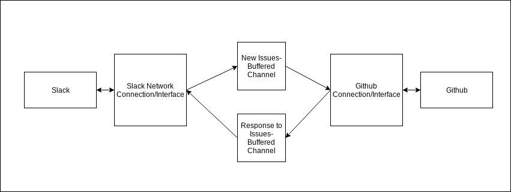

# issuebot

Issuebot is a slackbot that allows creating new github issues with a command

# Preliminary Design

## Summary:

Using https://godoc.org/github.com/shomali11/slacker (recommended by Sasha), I’m writing a Golang process that functions as a slackbot to post new github issues. The slackbot will listen for mentions (or private messages) and take a command and two string parameters in slack. The first string parameter is a repository, the second string parameter is text. This will become a new github issue, and the bot will reply with link or failure. When starting the process, specify a slack key, a github organization or user, and a newline-delimited list of authorized slack users.

### Example in CLI:

```
$: TOKEN=1283myslacktoken10293 ./issuebot --org=gravitational --auth=./userlist
...connecting to slack… success
...pinging github api… success
...looking for userlist… success
...looking for organization… success
(other basic logging)
```

<kbd>^C</kbd>: will give option to reload authed users or quit cleanly (ie stop accepting commands and finish whatever is in queue)  
<kbd>^C ^C</kbd>: get out as fast as possible (kill, not necessarily waiting for network to finish)

### Example in Slack:

**ayjay_t:**  
@issuebot new teleport Won’t compile on atari  
**issuebot:**  
Success: https://github.com/nlopes/slack/issues/460  

Or

**ayjay_t:**  
/msg @issuebot new issuebot Need to authenticate with SSO  
**issuebot:**  
Failure: Network error | No/Bad Repo | etc  

(if I can do custom commands I guess I will? `/issue new` makes sense if it’s easy- will assess)

## Basic Architecture:



*NB: The interfaces can deadlock if they're both trying to send on full channels instead of one emptying its receive channel, so two coprocesses (two for both slack and github section) makes sense if possible unless it can be ordered properly*

It’ll have an init for the flags, and an interface/structure to manage the slack cnx with a single goroutine that verifies user input and pushes commands+meta data onto a queue (a buffered channel probably). A github interface (I’m open to suggestions here) with another goroutine listening on the channel then tries to feed the issue into github and pushes a response+meta data back to (another?) slack goroutine through a buffered channel.


